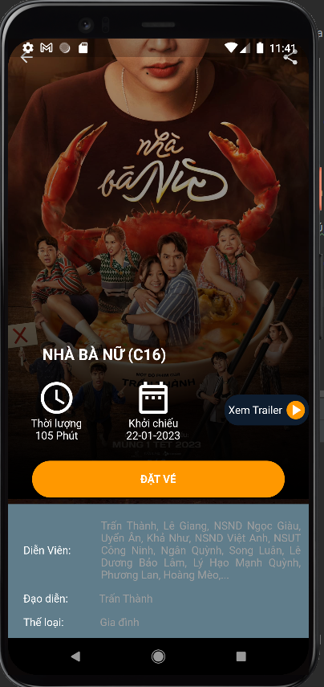
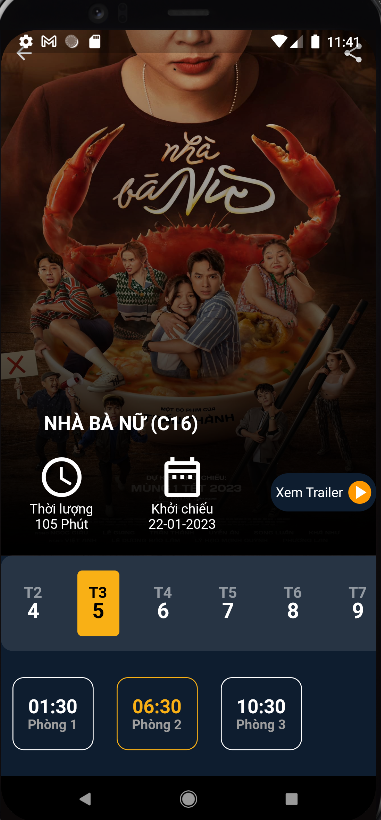

# METIZ CINEMA

Chào mừng bạn đến với Metiz Cinema App! Đây là một ứng dụng xem phim đa nền tảng, được xây dựng với sự kết hợp của Firebase, MockAPI, và các công nghệ khác. Dưới đây là mô tả chi tiết về ứng dụng và cách bạn có thể bắt đầu sử dụng nó.
## TÍNH NĂNG

- FirebaseStore: Lưu trữ dữ liệu phim, thông tin vé xem phim và các thông tin liên quan vào Firebase Store.

- Realtime Database: Sử dụng Realtime Database của Firebase để đảm bảo cập nhật thông tin phim và đặt vé ngay khi có sự thay đổi.

- Firebase Authentication: Bảo mật ứng dụng bằng Firebase Authentication, giúp quản lý và xác thực người dùng.

- Firebase Messaging: Sử dụng Firebase Cloud Messaging để gửi thông báo đến người dùng, giúp họ cập nhật thông tin mới nhất về ứng dụng và các sự kiện liên quan.

- Shared Preferences: Lưu trữ tạm thời thông tin về việc đặt vé xem phim bằng cách sử dụng Shared Preferences, giúp người dùng tiếp tục quá trình đặt vé sau khi thoát ứng dụng.

- MockAPI Integration: Sử dụng MockAPI để đồng bộ thông tin về phim và giữa các nguồn dữ liệu, giúp ứng dụng có thể trải nghiệm mượt mà và nhanh chóng.

## GIAO DIỆN + CHỨC NĂNG
- Đăng nhập

- Đăng ký

-Home

- Thông tin vé

- Chọn suất chiếu

- Chọn ghế 

- Trang thanh toán

- Đặt vé thành công

-